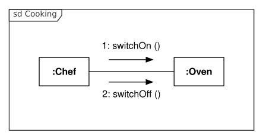
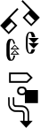
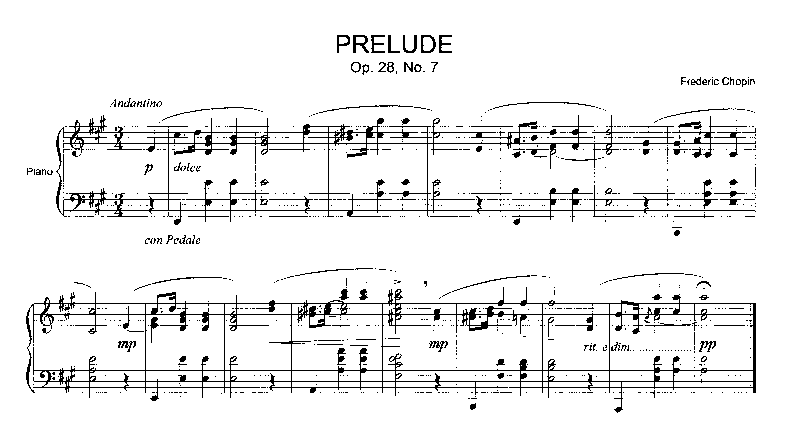

# Quevedo Datasets

Quevedo datasets consist of source images, annotations on those images, and
other metadata that can help with their interpretation. While it can be used for
less complex images, Quevedo's focus is on **images with compositional
meaning**, such as constitute visual languages, like [UML], or complex 
writing systems, like [SignWriting] or [musical notation].



*Example of an UML communication diagram (source: Oemmler @
[Wikipedia](https://commons.wikimedia.org/wiki/File:UML_Communication_diagram.svg))*



*Example of a SignWriting transcription representing the ASL sign for "SignWriting"
(source: Slevinski @
[Wikipedia](https://commons.wikimedia.org/wiki/File:SignWriting-render.svg))*


*An example of modern musical notation: Prelude, Op. 28, No. 7, by Frédéric Chopin
(source: Prof.rick @ [Wikipedia](https://commons.wikimedia.org/wiki/File:Chopin_Prelude_7.png))*

## Logograms and Graphemes

Quevedo recognises two types of source images: **logograms** and **graphemes**.
Graphemes are atomic, individual symbols that represent some particular meaning
in the target visual language, while logograms are images made up of graphemes
in complex and meaningful spatial arrangements. In the UML example above, the
different boxes, arrows and characters are graphemes. In the SignWriting
example, the hand symbols along with the arrows indicating movement are the
graphemes. In the sheet music excerpt, one can identify the notes, accidentals
and other symbols as graphemes. As for logograms, what constitutes a logogram depends on the
target language and the goal of the researcher, but to Quevedo, any logogram is an
image file where graphemes are arranged according to some underlying meaning.

The names logogram and grapheme come from the original problem for which Quevedo
has been designed, which is automatic recognition of visual languages, but the
software imposes little meaning to the terms beyond the fact that graphemes are
independent and atomic, and logograms are composed of spatially arranged
graphemes. Therefore, Quevedo can be used to manage datasets for problems of
varying complexity, as long as the source data are images with some
compositional structure.

## Annotation of logograms and graphemes

One of the characteristics of visual writing systems is that they can encode
multiple meanings within a single symbol, taking advantage of the possibilities
offered by the visual medium. In Quevedo, annotation consist not of a single
tag, but rather of a dictionary of tag names and values. This allows different
systems to peruse different aspects of the symbols' meaning, and also lets
researchers experiment with different, simultaneous and possibly overlapping
annotation schemas for the dataset.

Each grapheme in the dataset has one such dictionary of tags associated, manually
entered by an annotator or automatically filled by some process. Logograms, on
the other hand, don't have these tags directly, but rather in the graphemes they
contain. Logograms are annotated by marking the different graphemes contained
within them, and then tagging each grapheme with the tags from the tag schema.
Additionally, both graphemes and logograms can have "meta" tags which represent
other information. This can be used to store information about the filenames,
the source of the data, or in the case of logograms, information about the
logogram itself not associated with any particular grapheme.


*Example of the annotation of a logogram in the web interface*

## Dataset structure

Each Quevedo dataset is a directory on disk, containing a [configuration
file](config.md) named `config.toml`, and a number of directories. Files which
Quevedo doesn't recognize will be ignored, so it is safe to add these files that
other programs (such as [git] or [DVC]) may need.

Annotations are stored in subdirectories of the `logograms` and `graphemes`
directories (depending on their type). Each subdirectory represents a data
subset, which can be used to perform different experiments on different sets, or
just to organize data in some meaningful way.

Annotations in each subset consist of two files: `<number>.png` and
`<number>.json`. The `.png` file is the source image, in PNG format, and the
`.json` file contains the annotations in [JSON] format. These are standard
formats, so annotations in a Quevedo dataset can be read and modified by
external tools and inspected by humans. The annotations are sequentially
numbered, so corresponding images and json files are easily found.

There are two additional directories which Quevedo uses: `networks` and
`scripts`. In the `networks` directory, the training configuration and weight
files for each different [neural network](nets.md#network-configuration) are
stored. Each network has a name, and its files are all organized in the
subdirectory of `networks` with the network name.

The `scripts` directory can contain useful scripts for additional management of
the dataset. For example, a researcher can store the `.r` scripts used to
evaluate different metrics on the dataset, or shell scripts to process images or
extract annotation information. A special case are python files (ending in
`.py`) which Quevedo [can understand](dev.md#user-scripts).

```txt
dataset_root
├─ config.toml
├─ logograms
│  ├─ subset_1
│  │  ├─ 1.png
│  │  ├─ 1.json
│  │  ├─ 2.png
│  │  ├─ 2.json
│  │  └─ ...
│  └─ other_subset
├─ graphemes
│  ├─ subset_1
│  │  ├─ 1.png
│  │  ├─ 1.json
│  │  └─ ...
│  └─ other_subset
├─ networks
│  ├─ network_1
│  │  ├─ train
│  │  ├─ darknet.cfg
│  │  ├─ darknet_final.weights
│  │  ├─ results.json
│  │  └─ ...
│  └─ network_2
└─ scripts
```

*Example of a Quevedo dataset directory structure*

## Interaction with git and DVC

Since Quevedo datasets are directories on disk, and the different files use
standard formats, Quevedo datasets can interact nicely with other tools, such as
[git] and [DVC]. In particular, a Quevedo dataset can also be a git repository, and
therefore a DVC repository too. This can help with dataset sharing and
experiment reproducibility. We recommend using git to track configuration files
and scripts, and DVC to track source data, annotations, and experiments.


[UML]: https://www.uml.org/
[SignWriting]: https://www.signwriting.org/
[musical notation]: https://en.wikipedia.org/wiki/Musical_notation
[JSON]: https://www.json.org/json-en.html 
[git]: https://git-scm.com/
[DVC]: https://dvc.org/
