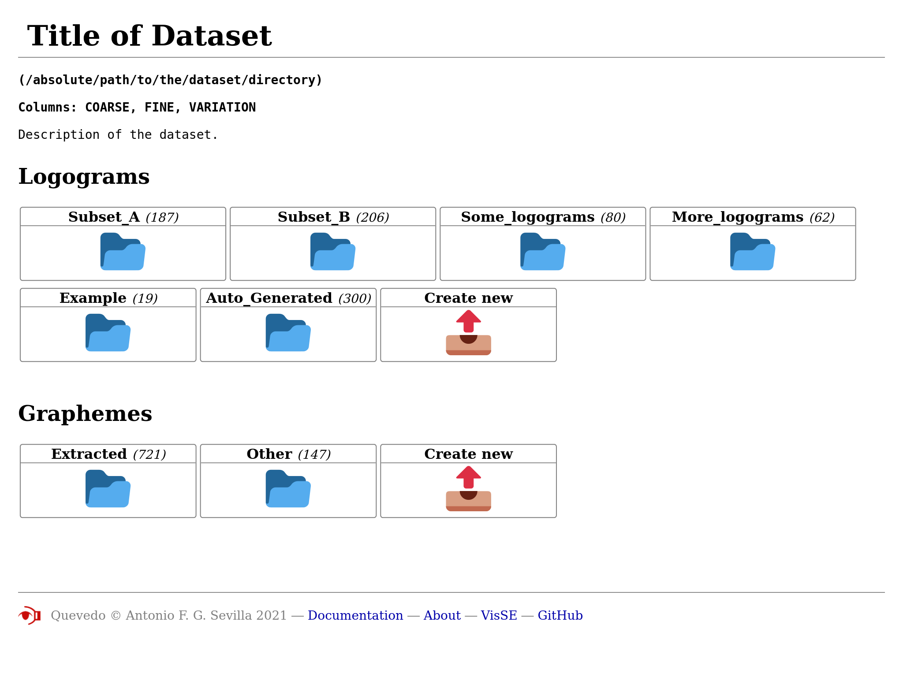
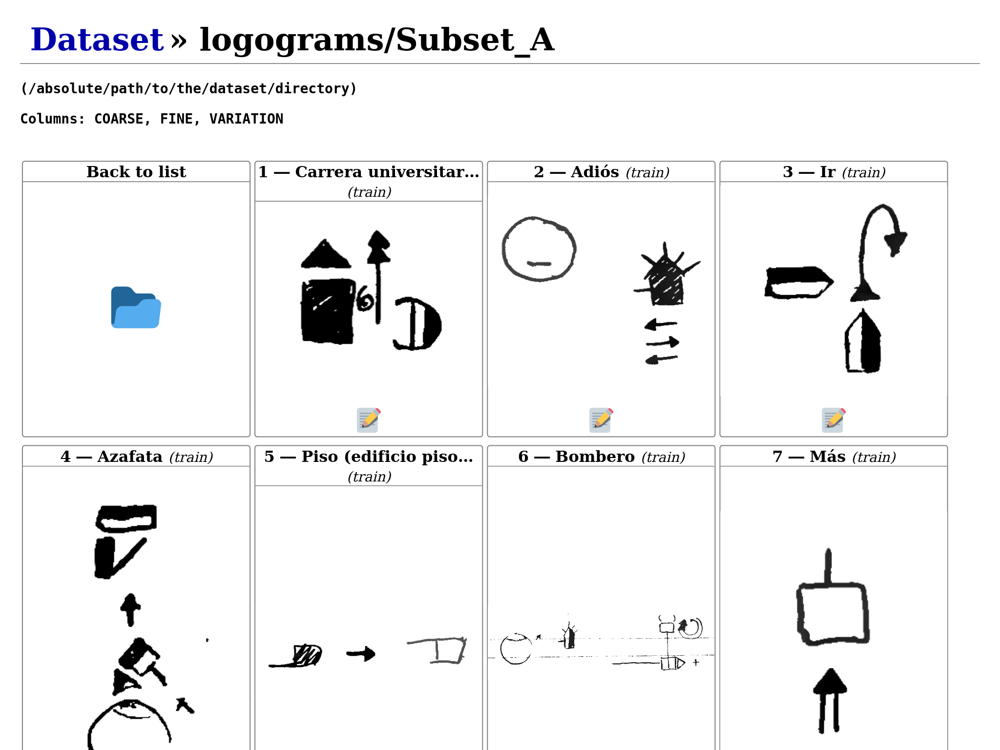
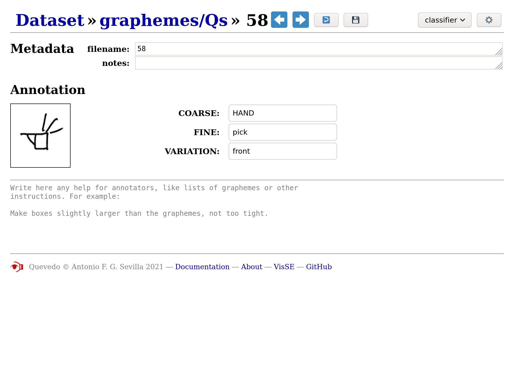
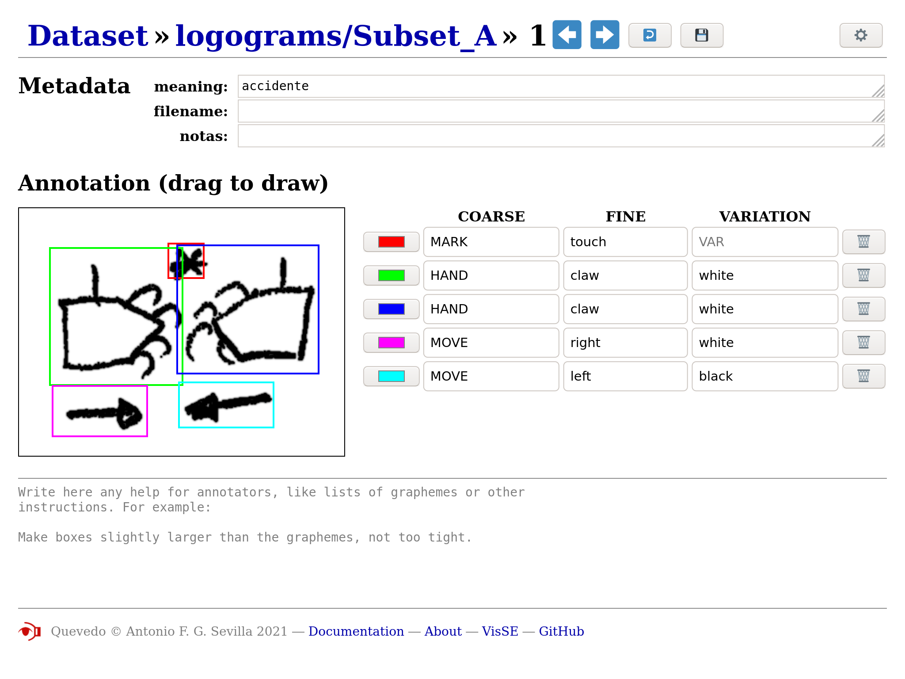

# Using the web interface

## Dataset overview

The main page of Quevedo's web interface presents an overview of the dataset,
with the different subsets of data listed as folders. On top, general dataset
information (from the configuration file) is listed. Data subsets are divided
into logogram and grapheme sets, and the number of images in each is noted.

Icons are actually Unicode Emojis, so they may differ between platforms. To
browse a subset, click on the folder icon. A new (empty) subset can be created
with the "Create new" button.

## Subset listing

Each subset has its own listing, where the images contained can be quickly
previewed. To go back to the general overview, click on the dataset title on the
top left or on the "back to list" icon. At the end of the listing, an "Upload
new" button allows adding images to the dataset (for a quicker way, see the
command [`add_images`](cli.md#add_images). Clicking on an image, or the "edit"
icon underneath, takes you to the annotation page.

## Grapheme annotation

The grapheme annotation page shows, under the heading "Annotation", the image to
annotate to the left, and the tags to the right. The tag headers are the ones
set in the dataset configuration file under the option `tag_schema`, and the
values are to be input by the user. On top of this, the metadata associated with
this annotation can be edited.

Below the annotation, any quick guide text set for annotators in the option
`annotation_help` is displayed.

The header contains a number of buttons for navigation and access to annotation
functions. The links allow you to navigate up to the overview or subset listing,
and the arrows after the annotation id navigate to the previous or next
annotation.

There is also an undo button that lets you revert any changes from this session
(even after saving, but not after navigating away). The save icon sends your
changes to the server to be stored in the dataset.

In the top right, a list of functions can be selected, and then run using the
gears button. The functions will do some transformation on the annotation, and
send it to you to be previewed. If the changes are OK, you can click the save
button to store them permanently.

!!! note
    If you are a collaborator, please ask the lead of the project what each of
    these functions do and when to use them.

The functions available are of two kinds:

#### Trained networks

When editing graphemes, any neural networks which have
been already trained and which have the task `classify` will be listed. When
run, the annotation image will be fed to the neural network, the prediction
decoded, and the new tags sent to the web interface. This can be used to
both visually check the networks, and to bootstrap manual annotation by
using the networks output as a first step.

#### User scripts

Any [user script](dev.md#user-scripts) under the `scripts` directory which has a
filename starting with *grapheme* will be listed and available for collaborators
to use. Please note that any code in the script will be able to be run by
collaborators, so if there are potentially dangerous operations or modifications
in the script, don't make it available in the web interface (by changing the
name) or properly advise your collaborators.

## Logogram annotation

The page for logogram annotation is very similar to the grapheme annotation
page, but the actual annotation area is more complicated.

On the right, instead of a list of tags, there is a table. Each row corresponds
to a different grapheme found within the logogram, and the columns are the tags
from the `tag_schema`. You can move right and left with `Tab` and `Shift+Tab`,
and up and down with the arrow keys in the keyboard.

To add a grapheme, click on the logogram image and drag the appearing rectangle
until it covers the full grapheme area. You can redo the rectangle while this
grapheme is selected, and you can always modify the rectangle for a grapheme
selecting it again by clicking on its row. To finish the rectangle and deselect,
click outside of the logogram image or press `Enter`. You can remove graphemes
by clicking on the Trash button at the right of each row. You can also change
the color of the grapheme rectangle with the button on the left of each row, but
please note that these colors are not stored by Quevedo, and are only a visual
aid to annotation while on the web interface.

As with graphemes before, changes can be undone, and must be sent to the server
to be stored with the Save button.

The networks offered in the functions list on the top right will be those which
have the task `detect`, and the scripts available will be those with filenames
starting with *logogram*.
